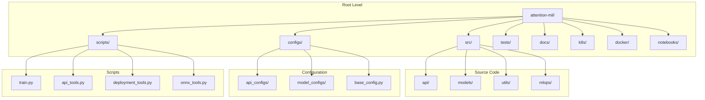

# 🧑‍💻 개발자 가이드 - 프로젝트 구조 및 역할

## 📋 개요

이 문서는 **Attention MIL Cancer Diagnosis** 프로젝트의 각 폴더와 스크립트가 어떤 역할을 하는지 **개발자 관점**에서 상세히 설명합니다. 새로운 기능을 추가하거나 기존 코드를 수정할 때 참고하세요.

---

## 🏗️ 프로젝트 구조 개요



---

## 📁 폴더별 상세 설명

### 🚀 **`src/` - 핵심 소스 코드**

#### **`src/api/` - API 서버 관련**
- **역할**: FastAPI 기반 REST API 서버 구현
- **주요 파일들**:
  - `main.py`: FastAPI 애플리케이션 진입점, 미들웨어 설정
  - `routes/`: API 엔드포인트 정의
    - `health.py`: 헬스체크 및 상태 모니터링
    - `predict.py`: 모델 추론 API
  - `middleware/`: CORS, 인증, 로깅 등 미들웨어
  - `utils/`: API 관련 유틸리티 (응답 형식, 검증 등)

#### **`src/models/` - AI 모델 구현**
- **역할**: Attention MIL 모델 및 관련 컴포넌트
- **주요 파일들**:
  - `attention_mil.py`: 핵심 Attention MIL 모델 클래스
  - `feature_extractor.py`: 이미지 특징 추출기 (EfficientNet 등)
  - `onnx_model.py`: ONNX 최적화된 모델 래퍼

#### **`src/utils/` - 공통 유틸리티**
- **역할**: 데이터 처리, 전처리, 공통 함수들
- **주요 파일들**:
  - `dataset.py`: CustomDataset 클래스 (PyTorch Dataset 상속)
  - `preprocessing.py`: 이미지 전처리 함수들
  - `visualization.py`: 결과 시각화 도구

#### **`src/mlops/` - MLOps 관련**
- **역할**: 모델 배포, 모니터링, 파이프라인 관리
- **현재 상태**: 기본 구조만 존재, 향후 확장 예정

### ⚙️ **`configs/` - 설정 관리**

#### **`configs/base_config.py`**
- **역할**: 공통 설정 클래스들의 기본 정의
- **주요 클래스들**:
  - `DatabaseConfig`: 데이터베이스 연결 설정
  - `LoggingConfig`: 로깅 설정
  - `MLflowConfig`: MLflow 실험 추적 설정
  - `SecurityConfig`: 보안 관련 설정

#### **`configs/model_configs/`**
- **역할**: 모델별 설정 파일들
- **주요 파일들**:
  - `attention_mil.yaml`: Attention MIL 모델 하이퍼파라미터
  - `attention_mil_config.py`: YAML 설정을 Python 객체로 변환

#### **`configs/api_configs/`**
- **역할**: API 서버 설정
- **주요 파일들**:
  - `fastapi_config.py`: FastAPI 서버 설정

#### **`configs/validators.py`**
- **역할**: 설정 파일 유효성 검증

### 🛠️ **`scripts/` - 실행 스크립트**

#### **`scripts/train.py`** ⭐ **핵심 스크립트**
- **역할**: Attention MIL 모델 학습 실행
- **주요 기능**:
  - 설정 파일 로드 및 검증
  - 데이터 로더 생성
  - 모델 초기화 및 학습
  - MLflow 실험 추적
  - 최고 성능 모델 저장
- **사용법**:
  ```bash
  python scripts/train.py --config configs/model_configs/attention_mil.yaml
  ```

#### **`scripts/api_tools.py`**
- **역할**: API 서버 테스트 및 유틸리티
- **주요 기능**:
  - API 엔드포인트 테스트
  - 성능 벤치마크
  - 배치 추론 테스트

#### **`scripts/deployment_tools.py`**
- **역할**: 배포 관련 도구들
- **주요 기능**:
  - Docker 이미지 빌드
  - Kubernetes 배포
  - 환경별 설정 관리

#### **`scripts/onnx_tools.py`**
- **역할**: ONNX 모델 변환 및 최적화
- **주요 기능**:
  - PyTorch → ONNX 변환
  - ONNX 모델 검증
  - 성능 최적화

#### **`scripts/Makefile`**
- **역할**: 자주 사용하는 명령어들을 간단하게 실행
- **주요 명령어들**:
  ```bash
  make train          # 모델 학습
  make test           # 테스트 실행
  make build          # Docker 이미지 빌드
  make deploy         # 배포
  ```

### 🧪 **`tests/` - 테스트 코드**

#### **`tests/unit/` - 단위 테스트**
- **역할**: 개별 함수/클래스 단위 테스트
- **주요 파일들**:
  - `test_models.py`: 모델 관련 단위 테스트
  - `test_utils.py`: 유틸리티 함수 테스트

#### **`tests/integration/` - 통합 테스트**
- **역할**: 여러 컴포넌트 간 상호작용 테스트
- **주요 파일들**:
  - `test_api.py`: API 전체 플로우 테스트

#### **`tests/fixtures/` - 테스트 데이터**
- **역할**: 테스트용 샘플 데이터 및 모델
- **주요 내용**:
  - `sample_images/`: 테스트용 이미지 파일들
  - `sample_models/`: 테스트용 모델 파일들

### 📚 **`docs/` - 문서**

#### **주요 문서들**:
- `project-overview.md`: 프로젝트 전체 개요
- `api-usage.md`: API 사용법 가이드
- `git-conventions.md`: Git 사용 컨벤션
- `ci-cd-pipeline.md`: CI/CD 파이프라인 설명
- `troubleshooting.md`: 문제 해결 가이드

### 🐳 **`docker/` - Docker 관련**

#### **`docker/Dockerfile`**
- **역할**: 애플리케이션 컨테이너 이미지 정의
- **주요 특징**:
  - Python 3.9+ 기반
  - CUDA 지원 (GPU 사용 시)
  - 의존성 최적화

#### **`docker-compose.yml`**
- **역할**: 로컬 개발 환경을 위한 서비스 구성
- **주요 서비스들**:
  - API 서버
  - MLflow 서버
  - 데이터베이스 (선택사항)

### ☸️ **`k8s/` - Kubernetes 배포**

#### **`k8s/dev/` - 개발/스테이징 환경**
- **역할**: 개발 및 스테이징 환경 배포 설정 (프로덕션 제거)
- **주요 파일들**:
  - `deployment.yaml`: 애플리케이션 배포 설정
  - `service.yaml`: 서비스 노출 설정
  - `configmap.yaml`: 환경별 설정
  - `secret.yaml`: 민감한 정보 (API 키 등)

### 📓 **`notebooks/` - 실험 및 분석**

#### **`notebooks/experiments/`**
- **역할**: 모델 실험 및 하이퍼파라미터 튜닝
- **주요 내용**:
  - 다양한 모델 아키텍처 실험
  - 데이터 증강 기법 테스트
  - 성능 분석 및 시각화

#### **`notebooks/exploration/`**
- **역할**: 데이터 탐색 및 분석
- **주요 내용**:
  - 데이터 분포 분석
  - 특징 중요도 분석
  - 오류 케이스 분석

#### **`notebooks/tutorials/`**
- **역할**: 사용법 가이드 및 예제
- **주요 내용**:
  - API 사용 예제
  - 모델 학습 가이드
  - 결과 해석 방법

---

## 🔧 개발 워크플로우

### **1. 새로운 기능 개발 시**

```bash
# 1. 브랜치 생성
git checkout -b feature/새기능명

# 2. 코드 개발
# src/ 관련 폴더에서 작업

# 3. 테스트 작성
# tests/ 폴더에 테스트 코드 추가

# 4. 테스트 실행
make test

# 5. 커밋 및 푸시
git add .
git commit -m "feat: 새기능 추가"
git push origin feature/새기능명
```

### **2. 모델 학습 시**

```bash
# 1. 설정 파일 수정
# configs/model_configs/attention_mil.yaml

# 2. 학습 실행
python scripts/train.py --config configs/model_configs/attention_mil.yaml

# 3. MLflow에서 결과 확인
mlflow ui
```

### **3. API 테스트 시**

```bash
# 1. API 서버 실행
python -m uvicorn src.api.main:app --reload

# 2. 테스트 스크립트 실행
python scripts/api_tools.py

# 3. 자동화 테스트
pytest tests/integration/test_api.py
```

---

## 🚨 주의사항 및 모범 사례

### **1. 코드 구조 관련**
- **새로운 모델 추가 시**: `src/models/` 폴더에 추가
- **새로운 API 엔드포인트**: `src/api/routes/` 폴더에 추가
- **공통 유틸리티**: `src/utils/` 폴더에 추가

### **2. 설정 관리**
- **환경별 설정**: `configs/` 폴더에서 관리
- **민감한 정보**: `k8s/dev/secret.yaml`에 저장
- **설정 검증**: `configs/validators.py` 활용

### **3. 테스트 작성**
- **단위 테스트**: 모든 새로운 함수/클래스에 작성
- **통합 테스트**: API 플로우 전체 테스트
- **테스트 데이터**: `tests/fixtures/` 폴더 활용

### **4. 문서화**
- **코드 주석**: 한국어로 작성
- **API 문서**: FastAPI 자동 문서화 활용
- **사용법 가이드**: `docs/` 폴더에 추가

---

## 🔍 문제 해결 가이드

### **자주 발생하는 문제들**

#### **1. 모듈 import 오류**
```python
# 문제: src 모듈을 찾을 수 없음
# 해결: sys.path에 프로젝트 루트 추가
import sys
sys.path.append(os.path.dirname(os.path.dirname(os.path.abspath(__file__))))
```

#### **2. CUDA 메모리 부족**
```python
# 해결: 배치 크기 줄이기
# configs/model_configs/attention_mil.yaml에서
batch_size: 8  # 16에서 8로 줄이기
```

#### **3. MLflow 연결 오류**
```bash
# 해결: MLflow 서버 상태 확인
mlflow server --host 0.0.0.0 --port 5000
```

---

## 📞 개발 지원

### **질문 및 이슈**
- **GitHub Issues**: 버그 리포트 및 기능 요청
- **GitHub Discussions**: 일반적인 질문 및 토론
- **Wiki**: 상세한 개발 가이드

### **코드 리뷰**
- **PR 생성 시**: 자동 코드 리뷰 요청
- **코드 품질**: Black, Flake8, mypy 자동 검사
- **테스트 커버리지**: pytest-cov로 자동 측정

---

*이 문서는 개발자들이 프로젝트를 이해하고 효율적으로 작업할 수 있도록 작성되었습니다. 지속적으로 업데이트됩니다.*
